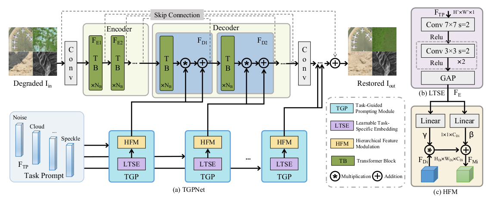
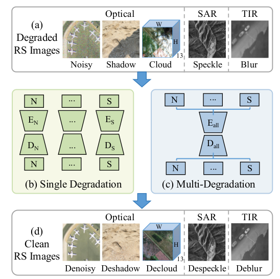
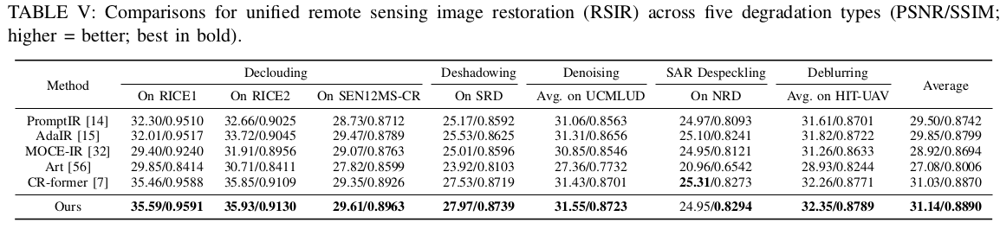
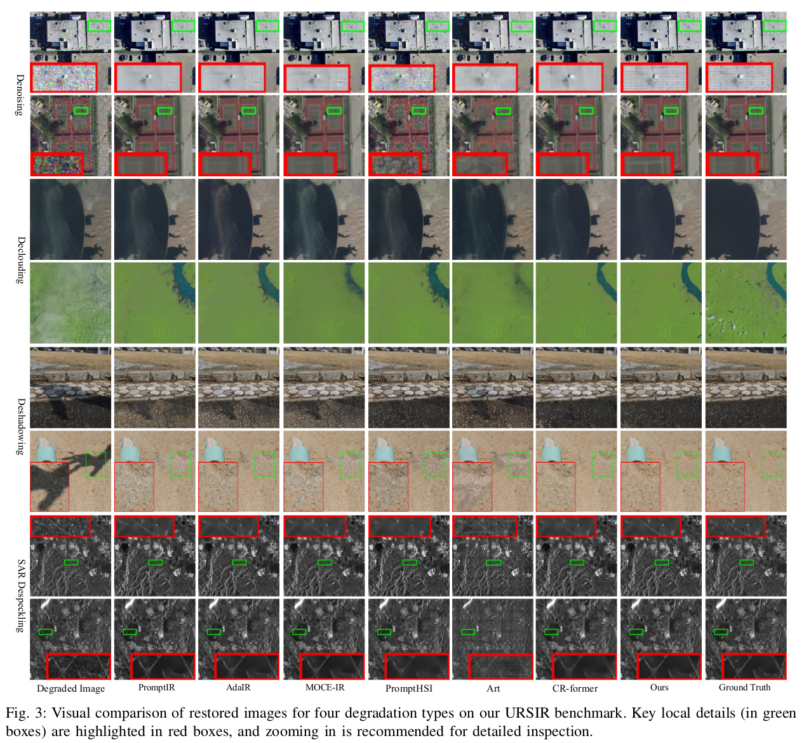

TGPNet: Task-Guided Prompting for Unified Remote Sensing Image Restoration

Wenli Huang*, Yang Wu*, Xiaomeng Xin, Zhihong Liu, Jinjun Wang, and Ye Deng, IEEE Transactions on Geoscience and Remote Sensing (TGRS), 2025

<!-- <!-- #### 🔥🔥🔥 News -->

- **2026-03-01:** Code and pre-trained models are released. 🎊🎊🎊 

---

> **Abstract:** Remote sensing image restoration (RSIR) is essential for recovering high-fidelity imagery from degraded observations, enabling accurate downstream analysis. However, most existing methods focus on single degradation types within homogeneous data, restricting their practicality in real-world scenarios where multiple degradations often across diverse spectral bands or sensor modalities, creating a significant operational bottleneck. To address this fundamental gap, we propose TGPNet, a unified framework capable of handling denoising, cloud removal, shadow removal, deblurring, and SAR despeckling within a single, unified architecture. The core of our framework is a novel Task-Guided Prompting (TGP) strategy. TGP leverages learnable, task-specific embeddings to generate degradation-aware cues, which then hierarchically modulate features throughout the decoder. This task-adaptive mechanism allows the network to precisely tailor its restoration process for distinct degradation patterns while maintaining a single set of shared weights. To validate our
> framework, we construct a unified RSIR benchmark covering RGB, multispectral, SAR, and thermal infrared modalities for five aforementioned restoration tasks. Experimental results demonstrate that TGPNet achieves state-of-the-art performance on both unified multi-task scenarios and unseen composite degradations, surpassing even specialized models in individual domains such as cloud removal. By successfully unifying heterogeneous degradation removal within a single adaptive framework, this work presents a significant advancement for multi-task RSIR, offering a practical and scalable solution for operational pipelines. The code and benchmark will be released at https://github.com/huangwenwenlili/TGPNet.




---



## ⚙️ Installation

- Python 3.9.0

- PyTorch 1.13.1

- NVIDIA GPU + [CUDA](https://developer.nvidia.com/cuda-downloads) 11.7

- Clone this repo:

  ```bash
  git clone https://github.com/huangwenwenlili/TGPNet.git
  cd TGPNet
  ```

- Create conda environment:

  ```bash
  conda env create -f TGPNet-env.yml -n TGPNet
  conda activate TGPNet 
  ```


## 🔗 Contents

1. [Datasets](#datasets)
1. [Models](#models)
1. [Training](#training)
1. [Testing](#testing)
1. [Results](#results)
1. [Citation](#citation)
1. [Acknowledgements](#acknowledgements)

---


## <a name="datasets"></a>🖨️ Datasets
- **TABLE I: Overview of the datasets comprising the benchmark for unified remote sensing image restoration (URSIR).**

- | Task            | Dataset     | Train   | Test    |
  | --------------- | ----------- | ------- | ------- |
  | Denoising       | UCMLUD      | 1680    | 420     |
  | Declouding      | RICE1/RICE2 | 400/558 | 100/148 |
  | Deshadowing     | SRD         | 2680    | 408     |
  | SAR Despeckling | NRD         | 250     | 20      |
  | Deblurring      | HIT-UAV     | 2029    | 579     |

  

- ```Denoising```: The UC Merced Land Use Dataset (UCM-LUD) is utilized for additive Gaussian noise removal, featuring high-resolution optical imagery from 21 diverse land-use categories.

- ```Declouding```: Three datasets are included to address declouding across various cloud types and sensor modalities. The RICE1 and RICE2 datasets provide RGB imagery for removing thin and thick clouds, respectively. 

- ```Deshadowing```: Shadow correction is evaluated using two distinct sources. The Shadow Removal Dataset (SRD) provides real-world optical images featuring complex shadow geometries across urban and natural landscapes. 

- ```SAR Despeckling```: The Near Real Dataset (NRD) is used for speckle reduction in SAR imagery. It consists
  of speckled Sentinel-1 data and corresponding clean reference images generated from time-series analysis.

- ```Deblurring```: The HIT-UAV dataset is used for Gauss deblurring, presenting a challenging task with thermal infrared imagery captured by UAVs in low-contrast environments.


Download training and testing datasets [Baidu Disk](https://pan.baidu.com/s/1coml2eF3E8r2wimmAmi8qA?pwd=pe53) and put them into the corresponding folders of `./datasets/`.


## <a name="models"></a>📦 Models

[Pretrained model Baidu Disk](https://pan.baidu.com/s/1kOaOteBnxZ0UAk_yCheqrQ?pwd=kupw)


## <a name="training"></a>🔧 Training
- The training configuration is in folder `option/TGPNet_train.yml`.

    - The argument `data_file_dir` in the `.yml` file specifies the path to the training dataset.
    - The argument `name` in the `.yml` file specifies the path to the training model (*.pth). By default, it is set to the `./experiments/name` folder.
    - The training experiments are stored in the `./experiments` directory.

- Run the following scripts for training
  ```shell
  # 5 degradation types, input=128*128, 2 GPU
  sh train_script/TGPNet.sh
  
  ```
  ```
  Set `-opt` as the model configuration option in the '.sh' command.
  ```
  
  
## <a name="testing"></a>🔨 Testing

- Download the pre-trained [model](https://pan.baidu.com/s/1kOaOteBnxZ0UAk_yCheqrQ?pwd=kupw) and place them in `./experiments/` directory.

- Use RICE1, RICE2, SRD, UCMLUD, NRD and HIT-UAV testing datasets.

- Test the model. 
  Run the following scripts for training

  ```shell
  # Test script
  sh test_script/TGPNet.sh
  ```

  ```
  - Set `--opt` as the model configuration option.
  - Set `--data_file_dir` as the input test dataset path.
  - Set `--benchmarks` as the test benchmarks, default as ['decloud_rice1', 'decloud_rice2', 'deshadow', 'desar', 'denoise_15', 'denoise_25', 'denoise_50','deblurgauss_5', 'deblurgauss_10']
  - Set `--de_type` as degradation types, default as ['denoise_15', 'denoise_25', 'denoise_50', 'decloud', 'deshadow', 'desar','deblurgauss_5', 'deblurgauss_10'].
  - The default results will be saved under the *results* folder.
  ```

## <a name="results"></a>🔎 Results

We achieved state-of-the-art performance. Detailed results can be found in the paper.

<details>
<summary>Quantitative Comparison (click to expand)</summary>

- Five degradation types results in Table IV of the main paper

<p align="center">
  
</p>
</details>

<details>
<summary>Visual Comparison (click to expand)</summary>

- results in Figure 3 of the main paper

<p align="center">
  
</p>


</details>


## <a name="citation"></a>📎 Citation

If you find the code helpful in your research or work, please cite the following paper(s).

```
@ARTICLE{wu2024cr,
	author={Wenli Huang, Yang Wu, Xiaomeng Xin, Zhihong Liu, Jinjun Wang, and Ye Deng},
	journal={IEEE Transactions on Geoscience and Remote Sensing}, 
	title={Task-Guided Prompting for Unified Remote Sensing Image Restoration}, 
	year={2025},
	volume={65},
	number={},
	pages={1-17}}
```

## License
<br />
The codes and the pre-trained models in this repository are under the MIT license as specified by the LICENSE file.
This code is for educational and academic research purpose only.

## <a name="acknowledgements"></a>💡 Acknowledgements

This code is built on [Restormer](https://github.com/swz30/Restormer) and  [CR-fromer](https://github.com/wuyang2691/CR-former). We thank the authors for sharing their codes.
